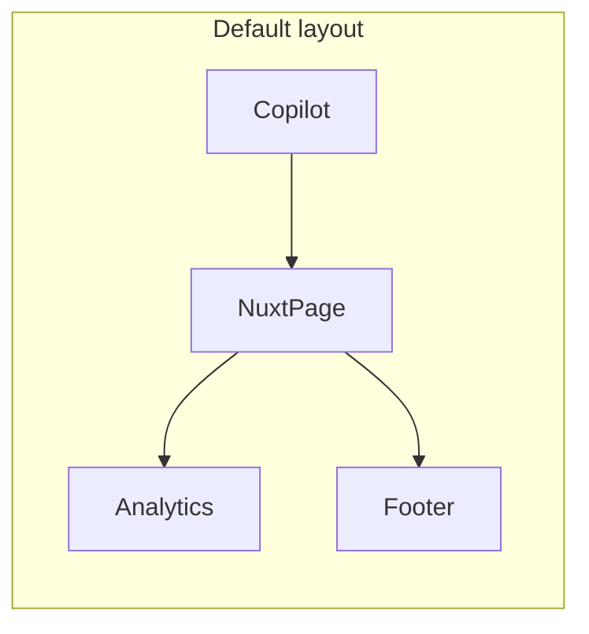

# Jobs and CRM index pages that fill the middle section

## How the app works today

- **[app/app.vue](app/app.vue)** renders a header (with nav) and `<main><NuxtPage /></main>`.
- The only page that uses the 3-column layout is **[app/pages/index.vue](app/pages/index.vue)** at `/`. The entire shell is inside that file:
  - **Left:** AI Dispatch Copilot (chat).
  - **Middle:** `<section class="jobqueue">` — content switches by `currentView` (dashboard/jobs/crm) and `selectedJob` / `selectedOpportunity`. Clicking EM-2041 calls `openEmergency(ticket)` and sets `selectedJob`, so the **detail renders in that same middle section** (no route change).
  - **Right:** Home Service Plans + Install Capacity.
  - **Footer:** Chat input.
- Nav uses **query params**: `/?view=dashboard`, `/?view=jobs`, `/?view=crm` (no real `/jobs` or `/crm` routes).
- **[app/pages/jobs/emergency/[id].vue](app/pages/jobs/emergency/[id].vue)** and **[app/pages/jobs/projects/[id].vue](app/pages/jobs/projects/[id].vue)** exist. Required behavior: **detail pages replace only the middle section**—copilot (left) and analytics (right) stay visible. Same as when you click EM-2041: only the middle changes.

The layout ensures every route renders only in the middle slot, never the whole page.

## Target behavior

- **Same 3-column shell** for all routes: copilot | **middle** | analytics + footer.
- `**/**` — dashboard in the middle (current dashboard content + in-page job/opportunity detail when something is selected).
- `**/jobs**` — jobs index in the middle (all emergency + all install), with links to detail routes.
- `**/crm**` — deals index in the middle (all opportunities), with links to deal detail.
- `**/jobs/emergency/[id]**`, `**/jobs/projects/[id]**` — job detail in the middle (same shell).
- `**/crm/[id]**` — deal detail in the middle (new route).

## Implementation plan

### 1. Add default layout (3-column shell)

- Create `**app/layouts/default.vue**`.
- Move from [app/pages/index.vue](app/pages/index.vue) into the layout:
  - The **grid** and **left column** (copilot), **right column** (analytics), **footer** (chat form).
  - The **middle column** becomes a single slot: `<section class="jobqueue ..."><NuxtPage /></section>`.
- Move into the layout’s `<script setup>` all state and logic the shell needs:
  - Imports: `emergencyQueue.json`, `installJobs.json`, `chatSeed.json`, `actionLogSeed.json`, `dashboardStats.json`, `opportunities.json`.
  - Refs: `emergencyQueue`, `installJobs`, `chatMessages`, `actionLog`, `dashboardStats`, `opportunities`, chat UI refs, `conversationState`.
  - Computed: `allCodes`, `suggestedCode`, `suggestionTail`, and any helpers used only by the copilot/sidebar.
  - Functions: `recomputeQuoteStats`, `pushAction`, `botReply`, `sendChat`, `quickAsk`, `scrollChatToBottom`, `acceptSuggestion`, `stageClassFor`, `opportunityStageClassFor`, `normalizeOpportunityStage`, and the full `botReply` logic.
- Call `recomputeQuoteStats()` in the layout’s `onMounted`.
- No `provide`/`inject` for the dashboard: the dashboard page will keep its own copy of data and selection state (see step 2).

### 2. Slim index.vue to “dashboard middle” only

- [app/pages/index.vue](app/pages/index.vue) becomes **only** the middle content for `/`.
- Keep in this file:
  - Imports for the same JSON (so dashboard has its own `emergencyQueue`, `installJobs`, `opportunities`, `dashboardStats`).
  - `currentView`, `selectedJob`, `selectedOpportunity`, and the template that switches on them:
    - `v-if="currentView !== 'crm' && selectedJob"` → Back + job detail (current block).
    - `v-else-if="currentView === 'crm' && selectedOpportunity"` → Back + opportunity detail.
    - `v-else-if="currentView === 'crm'"` → CRM overview + recent 5 opportunities.
    - `v-else` → Emergency queue list + Install pipeline list + (if dashboard) quote conversion + recent opportunities.
  - Handlers: `openEmergency`, `openProject`, `openOpportunity`, `openView`, and the computed titles.
- Sync `currentView` with the router: on load and when `route.query.view` changes, set `currentView`; when changing view, use `router.replace({ query: { ...route.query, view } })` so `/?view=jobs` and `/?view=crm` still work from the dashboard if desired. (Nav will later point to real `/jobs` and `/crm`.)
- Remove from index.vue: the grid wrapper, the left aside (copilot), the right aside (analytics), the footer, and all chat/bot logic (now in the layout).

Result: `/` uses the default layout and renders only the dashboard middle content; in-page detail (e.g. EM-2041) still works the same.

### 3. Ensure Nuxt uses `app/` and the layout

- In **[nuxt.config.ts](nuxt.config.ts)** set `**srcDir: 'app'**` so that `app/pages` and `app/layouts` are used and the new layout and routes are picked up.
- All pages use the default layout unless they set `layout: false`; no change needed on existing detail pages.

### 4. Jobs index page

- Create `**app/pages/jobs/index.vue**`.
- Route: `**/jobs**`.
- Template: single column for the middle only:
  - “← Back to dashboard” linking to `/`.
  - Heading “Jobs” (or “All jobs”).
  - **Emergency Queue (24/7):** list from `~/data/emergencyQueue.json`; each row is a `NuxtLink` to `/jobs/emergency/{{ ticket }}`.
  - **Commercial / Non-Emergency Install Pipeline:** list from `~/data/installJobs.json`; each row is a `NuxtLink` to `/jobs/projects/{{ id }}`.
- Script: load the two JSON files (same as layout/dashboard), no shared state with layout. Reuse the same list/card styling as the current emergency and install blocks in index.vue.

### 5. CRM index and deal detail pages

- Create `**app/pages/crm/index.vue**`.
  - Route: `**/crm**`.
  - Template: “← Back to dashboard”, heading “CRM” (or “All deals”), one list from `~/data/opportunities.json`; each row is a `NuxtLink` to `/crm/{{ opp.id }}`. Show id, company, date, value, stage (reuse the same stage badge logic as in index.vue).
- Create `**app/pages/crm/[id].vue**`.
  - Route: `**/crm/:id**`.
  - Template: “← Back to CRM” to `/crm`, then the same opportunity detail fields as the current in-page opportunity detail in index.vue (company, contact, source, created/updated, value, notes).
  - Script: load `~/data/opportunities.json`, find by `route.params.id`, or use a small static map if you prefer to mirror the existing detail pages’ style.

### 6. Nav and back links

- **[app/app.vue](app/app.vue):**
  - Change nav links from `/?view=dashboard`, `/?view=jobs`, `/?view=crm` to `**/**`, `**/jobs**`, `**/crm**`.
  - Set active class from `**route.path**` (e.g. `route.path === '/'`, `route.path === '/jobs'`, `route.path === '/crm'`).
- **[app/pages/jobs/emergency/[id].vue](app/pages/jobs/emergency/[id].vue)** and **[app/pages/jobs/projects/[id].vue](app/pages/jobs/projects/[id].vue):**
  - Change “← Back to dashboard” to **“← Back to jobs”** with `to="/jobs"` so from a job detail you return to the jobs index in the middle.

### 7. Optional: dashboard “View all” links

- On the dashboard (index.vue), where you have “View all” or “Most recent opportunities”, point those to `**/jobs**` and `**/crm**` instead of `openView('crm')` / `openView('jobs')`, so users can open the new index pages from the dashboard.

---

## Flow summary

- `**/**` → Layout + index.vue (dashboard middle; in-page detail on click).
- `**/jobs**` → Layout + jobs/index.vue (all jobs in middle).
- `**/jobs/emergency/:id**` → Layout + jobs/emergency/[id].vue (job detail in middle).
- `**/jobs/projects/:id**` → Layout + jobs/projects/[id].vue (project detail in middle).
- `**/crm**` → Layout + crm/index.vue (all deals in middle).
- `**/crm/:id**` → Layout + crm/[id].vue (deal detail in middle).

No new concepts: same “page in the middle” behavior as the current EM-2041 detail, achieved by making that middle slot the layout’s `<NuxtPage />` and adding two index pages plus one deal detail route.